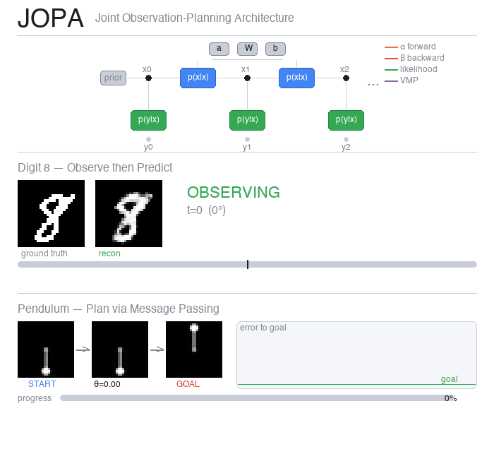
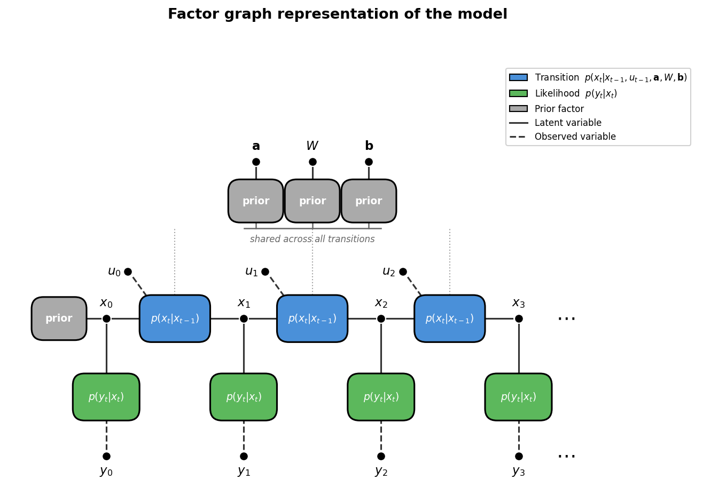
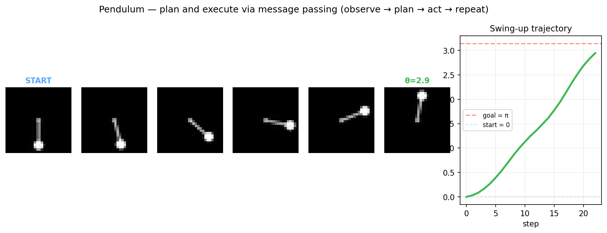
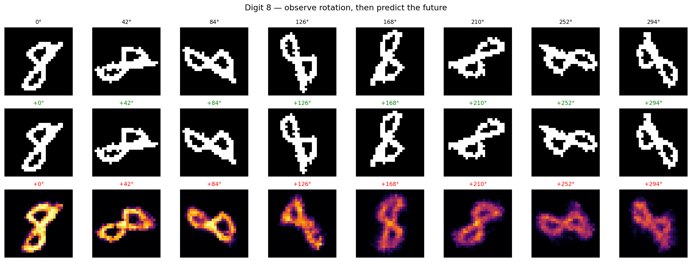

# 🍑 JOPA

**Joint Observation-Planning Architecture** — the same factor graph for learning and planning.

Or: Poor Man's Active Inference via message passing.

<p align="center">
  
</p>

<p align="center">
  <a href="https://arxiv.org/abs/2603.20927">Active Inference (de Vries, 2026)</a> &nbsp;·&nbsp;
  <a href="https://doi.org/10.3390/e23070807">VMP in Factor Graphs (Şenöz et al., 2021)</a> &nbsp;·&nbsp;
  <a href="https://lazydynamics.com">Lazy Dynamics</a>
</p>

---

JOPA is a feasibility study for doing perception, learning, and control on a single probabilistic factor graph. It takes raw pixel images and torque inputs, learns a latent dynamical system via Bayesian message passing, and plans actions by running inference on the same graph. No reward functions, no policy networks, no replay buffers.

This is a fun weekend project, not a paper. It shows the idea works on a toy pendulum and rotating digits. There are plenty of rough edges — see [Known limitations](#known-limitations) and the [open issues](https://github.com/lazydynamics/JOPA/issues) for what's missing.

> **How this was built.** This codebase was largely written by [Claude Code](https://claude.ai/code). The only component Claude couldn't derive was the message-passing rules for the Continuous Transition node — those were provided as hand-derived VMP update equations. Everything else was assembled from a description of the generative model.
>
> **Note on tests.** The inference diagnostic test suite has been removed from this release as it relies on internal tooling that cannot be open-sourced yet.

## The model



A linear dynamical system in a VAE's latent space:

$$x_t \mid x_{t-1}, u_{t-1} \sim \mathcal{N}(A\, x_{t-1} + B\, u_{t-1},\; W^{-1})$$
$$y_t \mid x_t \sim p_\theta(y_t \mid x_t) \quad \text{(VAE decoder)}$$

with priors on $\mathbf{a} = \text{vec}(A)$, $W$, and $\mathbf{b} = \text{vec}(B)$. Three tasks run on the same graph — only which variables are latent changes:

| Task | Inferred | Fixed |
|------|----------|-------|
| System identification | $A, B, W$ | VAE, images, actions |
| Variational EM | $A, B, W$ + VAE (gradient M-step) | images, actions |
| Planning | actions $u_t$ | $A, B, W$, start + goal images |

## What it does

**Learn dynamics** — forward-backward messages estimate latent states, VMP messages update beliefs about $A$, $B$, $W$. Variational EM refines the VAE encoder alongside the dynamics.

**Plan actions** — fix the learned model, observe start and goal images, treat actions as latent variables. The same VMP machinery infers an action sequence. A receding-horizon loop (observe → plan → act → repeat) gives closed-loop control from pixels.





## Why "Poor Man's Active Inference"?

It shares the spirit — perception and action as inference on a generative model — but cuts corners: gradient-based VAE training instead of full Bayesian treatment, no epistemic priors or expected free energy, linear dynamics only. The planning is goal-conditioned VMP, not proper Active Inference. But the factor graph is real, and every operation on it is a message.

## Known limitations

- **VAE pre-training is not message passing.** The observation model uses gradient descent. The EM refines it, but the initial representation comes from deep learning.
- **No velocity from a single image.** Can swing to a target but can't stabilise — a single frame doesn't encode angular velocity.
- **Linear dynamics.** Works when the VAE learns a good representation, breaks when it doesn't. Planning fails for some goal angles due to latent space topology.
- **Slow E-step.** Python loops over small matrices. The proper fix (JIT the full VMP loop) is an open problem.
- **Training variance.** Results depend on VAE initialisation. No automated validation that a checkpoint is good enough for planning.

## Contributing

Contributions are welcome. The best place to start is the open issues — each one describes a concrete direction that would make this more than a toy:

- [**Nonlinear transition node**](https://github.com/lazydynamics/JOPA/issues/1) — replace linear dynamics with a learned function, keeping the message passing structure
- [**Multi-frame encoder**](https://github.com/lazydynamics/JOPA/issues/2) — encode velocity from frame stacks to fix the stabilisation problem
- [**Expected free energy**](https://github.com/lazydynamics/JOPA/issues/3) — add epistemic priors for proper Active Inference
- [**Standard benchmarks**](https://github.com/lazydynamics/JOPA/issues/4) — CartPole, Acrobot, Reacher — show where the Bayesian approach helps

Pick one, open a PR, and we'll review it.

## Try it

```bash
git clone https://github.com/lazydynamics/JOPA.git && cd JOPA
uv pip install -e .
uv run python examples/pendulum.py        # swing-up demo
uv run marimo run notebook.py              # interactive notebook
```

## Structure

```
jopa/
  distributions.py     # Gaussian, Wishart in natural parameter form
  message_passing.py   # Forward-backward messages, VMP accumulation
  inference.py         # infer() — learn dynamics, plan() — infer actions
  em.py                # variational_em() — joint VAE + dynamics learning
  nodes/
    transition.py      # Continuous transition node (VMP message rules)
    observation.py     # VAE observation node
  nn/
    vae.py             # Convolutional VAE (Flax)
  data.py              # MNIST loading and rotation utilities
  envs/                # Simulation environments (pendulum)
```

## References

- de Vries, B. "Active Inference for Physical AI Agents — An Engineering Perspective", arXiv:2603.20927, 2026.
- Şenöz, I. et al. "Variational Message Passing and Local Constraint Manipulation in Factor Graphs", Entropy, 2021.

## License

GPL-3.0 — free to use, derivatives must also be open source.
