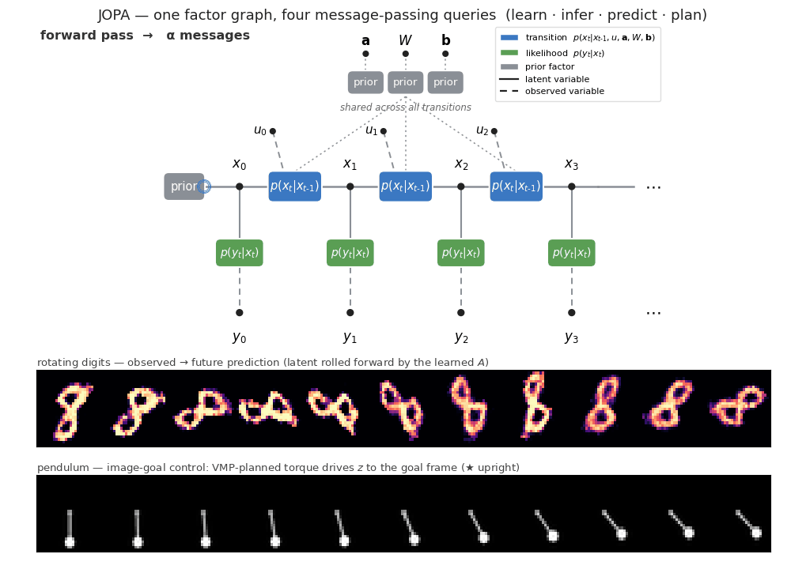

# 🍑 JOPA

**Joint Observation–Planning Architecture** — one factor graph that learns latent
dynamics, infers latent state, predicts the future, and plans actions. Every task
is Bayesian inference; every step is a message.

[](https://github.com/lazydynamics/JOPA/actions/workflows/ci.yml)

<p align="center">
  
</p>

<p align="center"><em>
  One factor graph, four message-passing queries. <b>Top:</b> the forward/backward
  passes, observation messages, and parameter/control messages — learning,
  smoothing, prediction and planning, all as message passing. <b>Bottom (real
  inference):</b> rotating-digit future prediction, and image-goal pendulum control.
</em></p>

<p align="center">
  <a href="https://arxiv.org/abs/2603.20927">Active Inference (de Vries, 2026)</a> &nbsp;·&nbsp;
  <a href="https://doi.org/10.3390/e23070807">VMP in Factor Graphs (Şenöz et al., 2021)</a> &nbsp;·&nbsp;
  <a href="https://lazydynamics.com">Lazy Dynamics</a>
</p>

---

## The model

<p align="center">
  
</p>

A `JointModel` is a factor graph; each `Block` adds a latent-state slice with a
**transition** factor and an **observation** factor — a linear-Gaussian latent
system with a learned likelihood, parameters **shared across all transitions**:

$$
\begin{aligned}
x_t \mid x_{t-1}, u_{t-1} \;&\sim\; \mathcal{N}\!\big(A\,x_{t-1} + B\,u_{t-1},\ W^{-1}\big) && \text{(transition)} \\
y_t \mid x_t \;&\sim\; p_\theta(y_t \mid x_t) && \text{(likelihood)} \\
\mathbf{a} = \mathrm{vec}(A),\ \ \mathbf{b} = \mathrm{vec}(B) \;&\sim\; \mathcal{N}(\cdot), \quad W \sim \mathcal{W}(\cdot) && \text{(shared priors)}
\end{aligned}
$$

Inference is **variational message passing** under a structured posterior
$q(x)\,q(\mathbf{a})\,q(\mathbf{b})\,q(W)$. The image likelihood is amortized — an
encoder (a learned VAE, or a fixed map) emits the Gaussian message

$$
q_\phi(x_t \mid y_t) = \mathcal{N}\!\big(x_t;\ \mu_\phi(y_t),\ \Sigma_\phi(y_t)\big)
$$

in place of $p_\theta(y_t \mid x_t)$, and a learnable decoder is refined in the M-step.
Controls $u_t$ and observations $y_t$ are observed (dashed in the figure); the **same
graph** answers four queries — only which variables are latent changes:

| Query | Inferred | Given |
|---|---|---|
| **System identification** | `A, B, W` (dynamics) | observations, controls |
| **Variational EM** | `A, B, W` + observation (VAE) weights | data |
| **Filtering · smoothing · prediction** | latent state `x_t` | model, observations |
| **Planning** | action sequence `u_t` | model, start + goal |

When the future isn't observed, the forward–backward pass that smooths the past
*predicts* it — inference and prediction are the same operation on different parts
of the chain.

## The agent loop

```python
model = JointModel([
    Block("z", LearnedLinear(dim=4, du=1), observe=encoder),
])

while True:
    obs     = sense()
    if learning_on:
        model.learn([trajectory_so_far])     # E-step (VMP) + optional M-step
    actions = model.plan(obs_horizon)        # VMP on the action sequence
    act(actions[0])
```

## Building blocks

| | |
|---|---|
| `Gaussian`, `Wishart` | Natural-parameter distributions — every message lives here |
| `Block(name, transition, observe)` | One latent-state slice |
| `LearnedLinear` | `x' ~ N(A·x + B·u, W⁻¹)`, conjugate VMP for `q(A,B,W)` |
| `LearnedAffine` | `y = A·x + B·u + ε`, fully-observed regression via the same VMP |
| `KnownPhysics` | Re-linearized gray-box dynamics |
| `Frozen(encode, decode)` | Fixed encoder + optional renderer |
| `LearnedVAE` | VAE encoder emits messages; weights refined in the M-step |
| `LinearCoupling` | Cross-block Gaussian factor — multimodal fusion |
| `JointModel.{learn, smooth, filter, plan}` | The four queries, as methods |

## A minimal example

System identification + planning on a controlled 2-D linear system (the latent
is seen only through `encode`):

```python
import numpy as np
from jopa import JointModel, Block, LearnedLinear, Gaussian

def encode(x):                          # x → Gaussian message
    lam = 1e4 * np.eye(2)
    return Gaussian(eta=lam @ x, lam=lam)

block = Block("z", LearnedLinear(dim=2, du=1, n_iterations=40), observe=encode)
model = JointModel([block])

model.learn(trajectories)               # [{"z": [x_0, x_1, …], "control": [u_0, …]}, …]
actions = model.plan({"z": [start, None, ..., goal]}, n_iterations=300)
```

## Examples

| Script | Demonstrates | |
|---|---|---|
| [`rotating_digits.py`](examples/rotating_digits.py) | Latent linear dynamics with a frozen VAE — rotation in `z` |  |
| [`controlled_digits.py`](examples/controlled_digits.py) | Add a control input; learn `B`, predict under action regimes | |
| [`end_to_end_digits.py`](examples/end_to_end_digits.py) | Variational EM — refine the VAE encoder alongside the dynamics | |
| [`pendulum.py`](examples/pendulum.py) | Image-only VAE + Variational EM + image-goal control — set a target frame, reach it by control | |

## Install & run

```bash
git clone https://github.com/lazydynamics/JOPA.git && cd JOPA
uv pip install -e ".[viz,test]"
uv run python examples/pendulum.py
uv run pytest                                 # 18 semantic tests
```

## Design notes

* **Bayesian inference is the only verb.** Learning, state inference, prediction and
  planning are each `q(·)` on a different subset of the same graph — no reward
  shaping, policy networks, or replay buffers.
* **Linear-Gaussian latent dynamics**, either assumed (`LearnedLinear` in latent
  space) or from a per-step local linearization (`KnownPhysics`). The VAE
  pre-training — autoencoding the observations — is the one non-message-passing
  bootstrap; the M-step then refines the encoder under the inferred dynamics.
* **Composability.** Adding a modality is appending a `Block`; information flows
  across slices through `LinearCoupling`. The `JointModel` knows only blocks and
  messages — not images, proprioception, or actions.

## References

* de Vries, B. *Active Inference for Physical AI Agents — An Engineering Perspective*, arXiv:2603.20927, 2026.
* Şenöz, I. et al. *Variational Message Passing and Local Constraint Manipulation in Factor Graphs*, Entropy 23(7), 2021.

## License

GPL-3.0.
