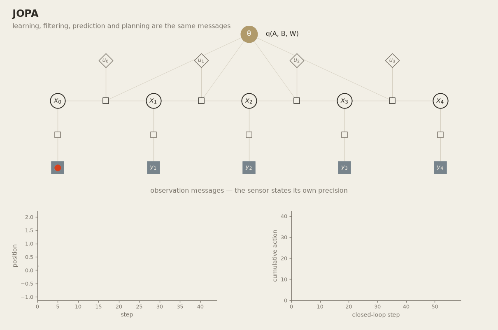
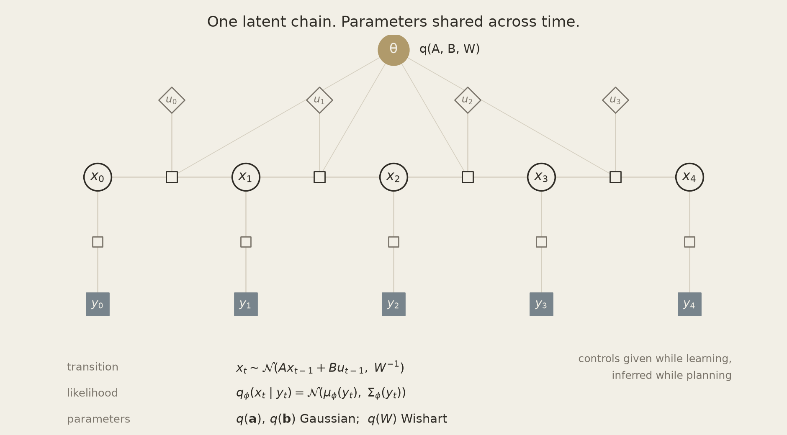
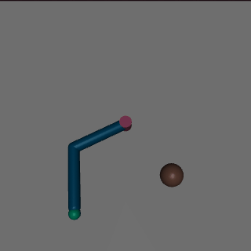
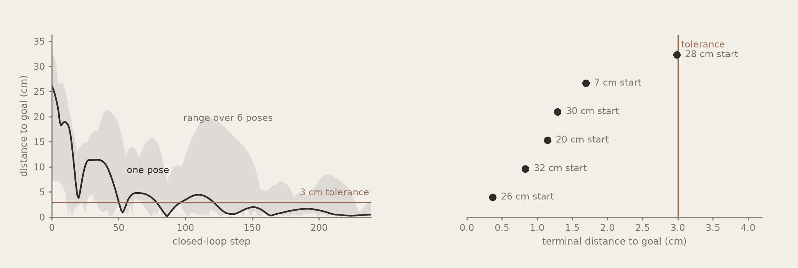
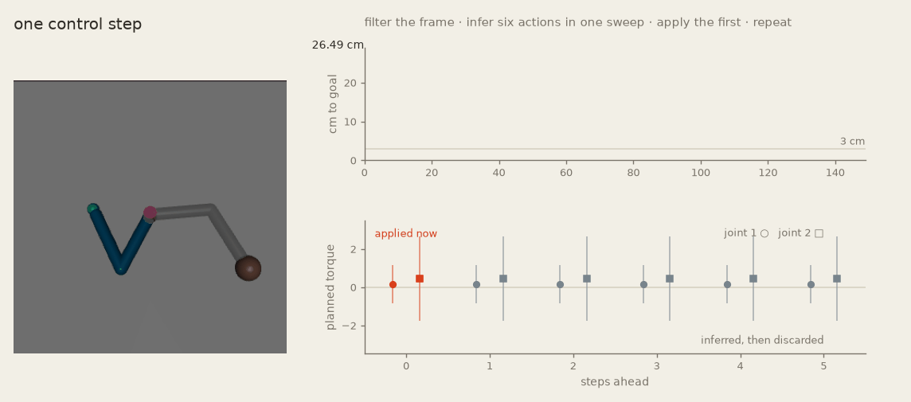

# 🍑 JOPA

**Joint Observation–Planning Architecture** — one factor graph that learns latent
dynamics, infers latent state, predicts the future, and plans actions. Every
*inference* task is message passing on that graph; the pixel encoder is the one
component trained by gradients.

<p align="center">
  
</p>

<p align="center"><em>
  Everything above is computed by the library — conjugate system identification,
  forward/backward message passing, and exact action inference on the same graph.
</em></p>

<p align="center">
  <a href="https://arxiv.org/abs/2603.20927">Active Inference (de Vries, 2026)</a> &nbsp;·&nbsp;
  <a href="https://doi.org/10.3390/e23070807">VMP in Factor Graphs (Şenöz et al., 2021)</a> &nbsp;·&nbsp;
  <a href="https://lazydynamics.com">Lazy Dynamics</a>
</p>

---

## Why message passing

A learned controller is usually four systems: an encoder, a dynamics model, a
state estimator, and a policy — each with its own objective, each discarding
what the next one needs. JOPA is one probabilistic model and four questions
asked of it:

| Question | Inferred | Given |
|---|---|---|
| **System identification** | dynamics `A, B, W` | observations, controls |
| **Variational EM** | dynamics *and* encoder weights, alternating | data |
| **Filtering · smoothing · prediction** | latent state `x_t` | model, observations |
| **Planning** | action sequence `u_t` | model, start + goal |

Variational EM is available when the observation is `learnable` — the E-step
smooths, the M-step takes gradient steps on the encoder against those smoothed
targets (`digits_end_to_end.py`). The Reacher pipeline does **not** use it: the
sensor is trained first on replay, then frozen, and only `q(A,B,W)` keeps
learning. Both routes are supported; they are not the same experiment.

Only which variables are latent changes. Nothing is retrained between
questions, and three properties follow from that.

**Uncertainty is carried end to end.** The sensor emits a Gaussian whose
per-dimension precision it sets itself. The dynamics are a posterior `q(A,B,W)` —
Gaussian over `A` and `B`, Wishart over the process precision — not point
estimates. The planner reads both. In the animation above, a sensor that
overstates its precision by 12× spends 1.9× the actuation and 2.0× the control
chatter for the same final accuracy, because it acts on its own noise.

**Planning is exact inference, not optimization.** Group each time slice as
`s_t = [x_t; u_t]` and the joint is a Gaussian chain, so the α/β recursions that
smooth the past are the optimal controller (LQG duality). One sweep, no
iteration, no mean-field cut between states and actions, no policy network.
Goals arrive as observations.

**Learning is continual by construction.** Conjugacy makes today's posterior
tomorrow's prior. `remember(forget=0.5)` tempers evidence in natural parameters,
so the model can track a drifting world instead of averaging over its history.
The deployed dynamics are 75 parameters, refit from a few hundred nearby
transitions in milliseconds.

## Relation to JEPA — and what changes for control

The pixel sensor is a VAE, and reconstruction is its largest single loss term —
pixels are what anchor the pose coordinates to something real. What it borrows
from JEPA is the *additional* objective: an action-conditioned latent rollout
that encodes a frame window, rolls the latent forward under the actions actually
taken, and penalises the error in the latent rather than in pixel space. That is
the term which makes the latent linearly predictable, which is what the
conjugate dynamics downstream require. That term carries the same collapse risk
joint-embedding methods face — a latent can satisfy a prediction objective by
becoming constant — so it uses the VICReg remedy: a per-dimension variance anchor
plus an off-diagonal covariance penalty.

The architectures differ in what they are for. I-JEPA and V-JEPA are
self-supervised representation objectives: no goals, no actions, no control.
Goal-directed planning belongs to the wider world-model programme those methods
feed into, not to the JEPA objective itself. JOPA is goal-conditioned by
construction — the goal is an observation, and planning is inference over the
same graph.

Three further differences follow from having to close a loop rather than feed a
downstream head:

- **The embedding is a distribution, not a point.** The encoder emits
  `N(μ(y), Σ(y))` with heteroscedastic precision, calibrated against held-out
  innovations. Fusing vision with dynamics requires knowing how much to trust
  the encoder on this frame; a point embedding cannot express that.
- **The predictor becomes a posterior.** In I-JEPA the predictor serves the
  pretext task and the encoder is the product; V-JEPA 2's action-conditioned
  variant does keep a predictor for planning, but as a learned network. Here the
  predictor used during sensor training is thrown away and replaced by the
  conjugate `q(A,B,W)` — a distribution over dynamics that plans, filters and
  keeps learning online.
- **The latent is structured.** For an articulated arm the state is
  `[pose(4), motion(2)]`: pose from a single frame, motion from differences of
  consecutive pose encodings, and the decoder sees pose only, so velocity cannot
  enter the position channels. A static goal image is `[pose(image), 0, 0]`.

Practical consequences: there is no reward function to design, the deployed
model is small enough to refit inside the control loop, and the controller
reports calibrated uncertainty about both the state and its own dynamics.

## The model

<p align="center">
  
</p>

A `JointModel` is a factor graph; each `Block` contributes a latent slice with a
**transition** factor and an **observation** factor. Transition parameters are
shared across all time steps:

$$
\begin{aligned}
x_t \mid x_{t-1}, u_{t-1} \;&\sim\; \mathcal{N}\!\big(A\,x_{t-1} + B\,u_{t-1},\ W^{-1}\big) && \text{(transition)} \\
y_t \mid x_t \;&\sim\; p_\theta(y_t \mid x_t) && \text{(likelihood)} \\
\mathbf{a} = \mathrm{vec}(A),\ \ \mathbf{b} = \mathrm{vec}(B) \;&\sim\; \mathcal{N}(\cdot), \quad W \;\sim\; \mathcal{W}(\cdot) && \text{(shared priors)}
\end{aligned}
$$

State and parameter inference is variational message passing under the
structured posterior $q(x)\,q(\mathbf{a})\,q(\mathbf{b})\,q(W)$: mean-field
*between* the four groups, but $q(x)$ keeps the full chain structure, so the
latent trajectory is never factorized over time. Encoder weights $\phi$ are not
in this factorization — they are fitted by gradient descent, and the resulting
$\mathcal{N}\big(\mu_\phi(y_t), \Sigma_\phi(y_t)\big)$ enters as an amortized
stand-in for $p_\theta(y_t \mid x_t)$. Planning is the exception to the
mean-field split: states and actions are solved jointly and exactly.

When the future carries no observation, the forward–backward sweep that smooths
the past predicts it — inference and prediction are one operation on different
parts of the chain.

### Where the transition rules come from

Most of the work happens in one node: `ContinuousTransition` in
[`jopa/nodes/transition.py`](jopa/nodes/transition.py), the structured VMP rules
for $y \sim \mathcal{N}(Ax + Bu, W^{-1})$ when $x$ and $y$ are *both* uncertain.
That caveat is the entire difficulty. Cut the posterior as $q(y)\,q(x)$ and the
transition matrix you learn is attenuated toward zero — errors-in-variables — so
the rules have to carry $\mathbb{E}[A M A^\top]$ and the parameter-uncertainty
contractions you see in the code. Keeping $q(y,x)$ joint is what makes it
possible to learn dynamics from latents that were themselves inferred.

Everything else here is that node asked a different question. Filtering,
smoothing and prediction are its forward and backward messages; learning
$q(A,B,W)$ is its parameter messages; action inference is either a message from
the same node (`ct_message_u`) or a Gaussian chain assembled from the same
cached posterior expectations.

The rules themselves are not new. They were derived and integrated into
[RxInfer](https://rxinfer.com) some time ago; the write-up remains unpublished.

## The agent loop

```python
from jopa import Agent, Block, JointModel, LearnedLinear

model = JointModel([
    Block("z", LearnedLinear(dim=6, du=2, offset=True), observe=encoder),
])
model.learn(replay)                           # conjugate system identification

agent = Agent(model, horizon=6, forget=0.5)   # filter -> plan -> act -> learn
agent.goal(goal_image)                        # goals are observations too
while True:
    u = agent.step(camera())                  # one message-passing cycle
    act(u)
```

`encoder` is anything mapping an observation to a Gaussian message, so the same
loop drives your environment: wrap a feature extractor in `Frozen`, or use
`VAEObservation` / `PoseMotionObservation` for learned pixel sensors.

## How it fits together

Every example follows the same spine — an `Observation` turns data into a
Gaussian message, a `Block` pairs it with a transition, and `JointModel`
answers one of the four questions. What differs is how the sensor is obtained
and which question gets asked.

**Offline.** Collect observations and actions. Train a sensor by gradient
descent — the only gradients in the system. Encode the data once. Then fit
`q(A,B,W)` by message passing: each encoded observation becomes a message,
forward–backward smooths the chain, and the accumulated messages update the
parameter posteriors. Nothing here is a point estimate.

**Online.** Every step is inference, at three levels of the same graph:
the **state** is filtered (transition message predicts, observation message
updates), the **parameters** may be refit from nearby past experience — still
conjugate VMP, not gradients — and the **actions** are the posterior from one
exact sweep. Apply the first action, discard the rest, repeat.

| stage | digits | pendulum | reacher |
|---|---|---|---|
| sensor objective | `train_vae` (pixel ELBO) | `train_vae` | `train_pose_motion_vae` (action-conditioned latent rollout) |
| sensor after fitting | frozen (`Frozen`) — or refined jointly by variational EM in `digits_end_to_end` | refined in the M-step | frozen |
| dynamics `q(A,B,W)` | `model.learn` | `model.learn` | `model.learn`, then refit locally each step |
| question asked | `smooth` (+ prediction) | `plan`, `Agent` | `Agent` (closed loop) |
| goal | — | a target image | a target image, with decoder-Jacobian precision |

Local refitting, decoder-Jacobian goal geometry and the distance-conditioned
action prior are used only by the Reacher; they exist because a single global
linear model cannot represent an articulated arm across its whole workspace.

## MuJoCo Reacher from pixels

A two-link arm reaching a target it has only ever seen. The agent receives 64×64
grayscale frames and its own torques. No joint angles, no velocities, no reward,
no simulator state. The goal is an image of the arm at the target.

<p align="center">
  
</p>

```bash
python -m examples.reacher.run train    --data outputs/gpu_run   # sensor + q(A,B,W)
python -m examples.reacher.run validate --data outputs/gpu_run   # pixel-only diagnostics
MUJOCO_GL=egl python -m examples.reacher.run evaluate \
    --pose-seed 515151 --poses 20                                # closed loop
```

40 poses, two seeds disjoint from every training and tuning decision, 240
closed-loop steps each, sensor and dynamics frozen:

| | result |
|---|---|
| poses reaching within 1 cm | 40 / 40 |
| poses within 3 cm over the last 20 steps (mean) | 30 / 40 |
| poses whose worst error in the last 20 steps is under 3 cm | 24 / 40 |
| poses under 3 cm for 95% of the last 60 steps | 14 / 40 |
| control step (local refit + exact planning) | 66 ms |

<p align="center">
  
</p>

One control step, in full: the frame is filtered, six future torques are
inferred in a single exact sweep with their posterior spread, the first is
applied, and the rest are discarded and re-inferred next step.

<p align="center">
  
</p>

Every pose reaches the goal; the terminal error is not uniformly settled — some
poses oscillate around the goal within a few centimetres rather than parking.
`evaluate` writes per-pose traces and both the mean and maximum terminal
criteria.

The sensor (`jopa/nn/pose_motion.py`) is trained on the agent's own replay. The
deployed dynamics are the conjugate posterior, refit each step from the nearest
encoded transitions. Every torque is the mean of the exact action posterior.

Sensor training runs on GPU and is compute-bound. The closed loop is reported on
CPU for two reasons: at a 6-D state the per-step work is 6×6 linear algebra, so
it is dispatch-bound rather than compute-bound (measured GPU utilisation during
stepping: 2–3%), and GPU runs are not bit-reproducible — XLA autotuning makes
otherwise identical episodes diverge, while CPU episodes are identical across
processes. The 66 ms is therefore the reproducible figure, not a ceiling.

## Building blocks

| | |
|---|---|
| `Gaussian`, `Wishart` | Natural-parameter distributions — every message lives here |
| `Block(name, transition, observe)` | One latent-state slice |
| `JointModel.{learn, smooth, filter, plan}` | The four queries as methods; `plan()` returns the exact Gaussian action posterior in one sweep |
| `Agent(model, horizon, forget, ...)` | The closed loop, with surprise- and excitation-gated relearning |
| `LearnedLinear` | `x' ~ N(A·x + B·u [+ c], W⁻¹)` with conjugate `q(A,B,W)`; `offset=True` learns a constant drift |
| `LearnedLinear.attach_replay` / `.localize` | Refit the posterior from the nearest encoded transitions — local dynamics without leaving conjugacy |
| `LearnedLinear.remember(forget)` | Posterior becomes the next prior — continual learning with exponential forgetting |
| `KnownPhysics` | Re-linearized gray-box dynamics |
| `Frozen(encode, decode)` | Any fixed encoder, plus an optional renderer |
| `VAEObservation` | Frozen probabilistic VAE sensor — heteroscedastic messages from pixels |
| `PoseMotionObservation` | Structured `pose[4] + motion[2]` pixel sensor with static image goals and decoder-Jacobian goal geometry |
| `LinearCoupling` | Cross-block Gaussian factor — multimodal fusion |

Library layout: `distributions.py` (messages) · `observations.py` (likelihoods) ·
`transitions.py` (dynamics) · `graph.py` (`Block`, `JointModel`, coupling) ·
`message_passing.py` (α/β sweeps, exact planning) · `agent.py` (the loop) ·
`nn/` (learned sensors).

## A minimal example

System identification then planning on a controlled 2-D system, where the latent
is seen only through `encode`:

```python
import numpy as np
from jopa import Block, Gaussian, JointModel, LearnedLinear

def encode(x):
    lam = 1e4 * np.eye(2)
    return Gaussian(eta=lam @ x, lam=lam)

model = JointModel([
    Block("z", LearnedLinear(dim=2, du=1, n_iterations=40), observe=encode),
])
model.learn(trajectories)                                # [{"z": [...], "control": [...]}, ...]
actions = model.plan({"z": [start, None, None, goal]})   # exact posterior, one sweep
```

## Examples

| script | what it shows |
|---|---|
| [`examples/reacher/`](examples/reacher) | pixel-and-action-only MuJoCo Reacher: `run.py` (train/validate/evaluate), `runtime.py` (the closed loop), `validation.py` (pixel-only diagnostics), `collect.py` |
| [`digits_rotating.py`](examples/digits_rotating.py) | latent linear dynamics behind a frozen VAE; the smoothing sweep extrapolating |
| [`digits_controlled.py`](examples/digits_controlled.py) | add controls, learn `B`, predict under action regimes |
| [`digits_end_to_end.py`](examples/digits_end_to_end.py) | variational EM — dynamics and VAE weights learned together |
| [`pendulum.py`](examples/pendulum.py) | image-goal control on a classic plant |
| [`figures/hero.py`](figures/hero.py) | regenerates the animation and model figure at the top of this page |
| [`figures/planning.py`](figures/planning.py) | regenerates the closed-loop planning animation |

## Checkpoint validation

Before planning with a learned checkpoint, gate it on held-out observations:

```bash
uv run jopa-validate \
  --vae checkpoints/vae_d4.npz \
  --sequence data/heldout_sequence.npy \
  --latent-dim 4 \
  --dynamics checkpoints/dynamics.pkl \
  --max-reconstruction-mse 0.02 \
  --min-latent-linearity-r2 0.8 \
  --max-one-step-latent-mse 0.05
```

The report covers reconstruction MSE, latent linearity R², and one-step latent
prediction MSE; the threshold flags make the command exit non-zero, so loops can
gate on the same signal.

## Install and run

```bash
git clone https://github.com/lazydynamics/JOPA.git && cd JOPA
uv sync                            # library + digit/pendulum examples
uv sync --extra reacher            # adds MuJoCo for the Reacher example
uv run pytest tests -q             # run per file: JAX compilation caches add up
```

Everything except sensor training runs on CPU in minutes. **A GPU is needed for
exactly one thing: training a pixel sensor** (`train` below, ~2 h on one A100).
Inference — filtering, planning, closed-loop control — is 6×6 linear algebra
per step and is dispatch-bound, so CPU is the faster and the reproducible
choice.

| Command | Needs | Time |
|---|---|---|
| `python -m examples.digits_rotating` | CPU | ~15 s warm, ~4 min cold (trains a small VAE) |
| `python -m examples.digits_controlled` | CPU | ~1 min |
| `python -m examples.digits_end_to_end` | CPU | ~5 min (variational EM) |
| `python -m examples.pendulum` | CPU | ~30 min first run, ~10 s after (EM result is cached) |
| `python figures/hero.py --out assets/hero.gif` | CPU | ~2 min |
| `MUJOCO_GL=egl python figures/planning.py` | CPU + MuJoCo | ~3 min |
| `python -m examples.reacher.run train --data outputs/gpu_run` | **GPU** | ~2 h |
| `python -m examples.reacher.run validate --data outputs/gpu_run` | CPU | ~10 min |
| `MUJOCO_GL=egl python -m examples.reacher.run evaluate` | CPU + MuJoCo | ~5 min |

The Reacher `train` step needs pixel/action replay in `--data`; `evaluate`
reads the frozen sensor and dynamics from `--outdir` (default
`outputs/reacher_pixels`) and writes traces, per-pose metrics and video there.
`MUJOCO_GL=egl` is required for headless rendering.

## Design notes

- **Bayesian inference is the only verb.** Learning, state inference, prediction
  and planning are each `q(·)` over a different subset of the same graph — no
  reward shaping, policy networks, or replay-buffer retraining.
- **Linear-Gaussian latent dynamics**, either global or refit locally around the
  current belief. The encoder is the one gradient-trained component.
- **Planning is exact inference.** The joint over states and actions is Gaussian,
  so the action posterior is one forward–backward sweep in information form. The
  iterative VMP planner remains available as `plan(method="vmp")`.
- **Composability.** Adding a modality is appending a `Block`; information flows
  across slices through `LinearCoupling`. `JointModel` knows only blocks and
  messages — not images, proprioception, or actions.
- **Continual learning is conjugacy.** Forgetting and parameter drift are
  *priors* — exponential forgetting, random-walk diffusion on volatile
  parameters — not optimizer tricks.

## References

- de Vries, B. *Active Inference for Physical AI Agents — An Engineering Perspective*, arXiv:2603.20927, 2026.
- Şenöz, I. et al. *Variational Message Passing and Local Constraint Manipulation in Factor Graphs*, Entropy 23(7), 2021.
- Assran, M. et al. *Self-Supervised Learning from Images with a Joint-Embedding Predictive Architecture*, CVPR 2023.
- Bardes, A., Ponce, J., LeCun, Y. *VICReg: Variance-Invariance-Covariance Regularization*, ICLR 2022.
- Watter, M. et al. *Embed to Control*, NeurIPS 2015; Zhang, M. et al. *SOLAR*, ICML 2019.

## License

GPL-3.0.
