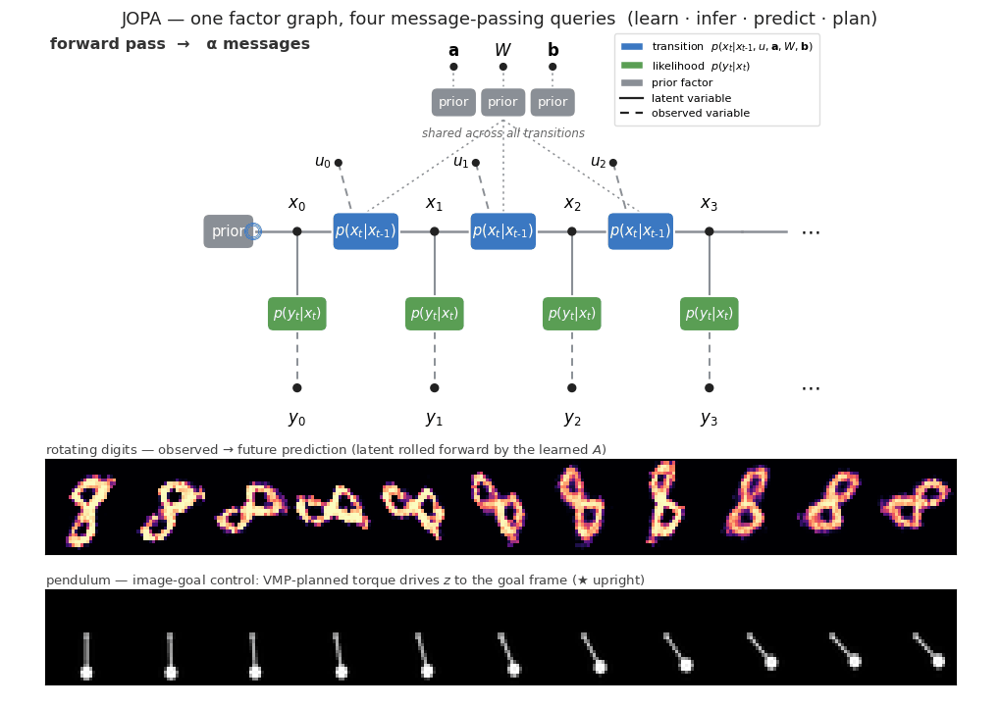
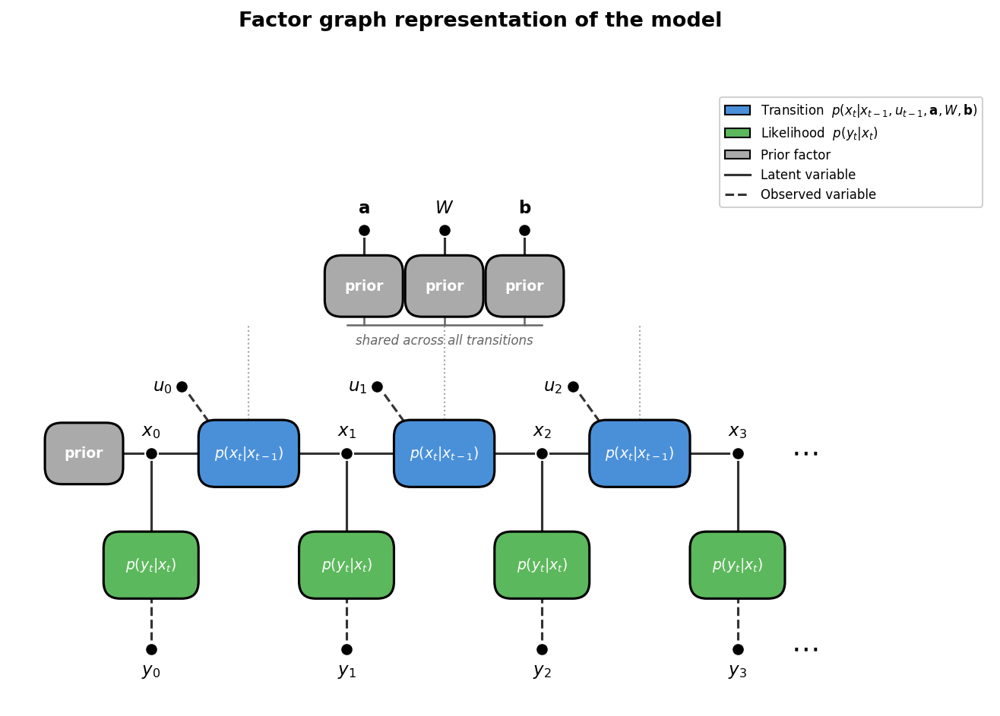
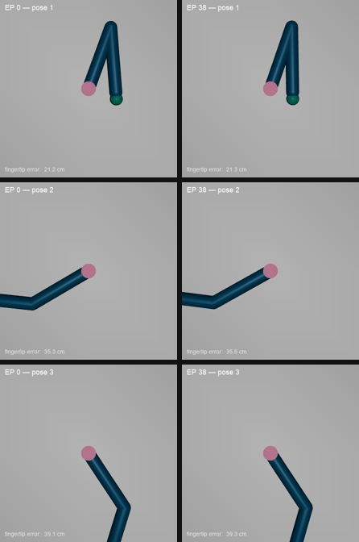
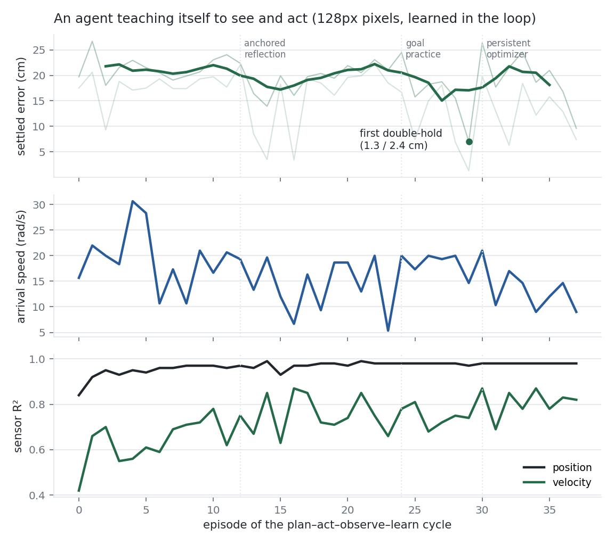
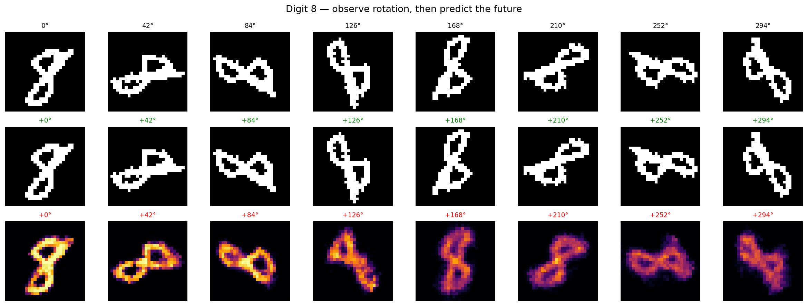

# 🍑 JOPA

**Joint Observation–Planning Architecture** — one factor graph that learns latent
dynamics, infers latent state, predicts the future, and plans actions. Every task
is Bayesian inference; every step is a message.

<p align="center">
  
</p>

<p align="center"><em>
  One factor graph, four message-passing queries. <b>Top:</b> the forward/backward
  passes, observation messages, and parameter/control messages — learning,
  smoothing, prediction and planning, all as message passing. <b>Bottom (real
  inference):</b> rotating-digit future prediction, and image-goal pendulum control.
</em></p>

<p align="center">
  <a href="https://arxiv.org/abs/2603.20927">Active Inference (de Vries, 2026)</a> &nbsp;·&nbsp;
  <a href="https://doi.org/10.3390/e23070807">VMP in Factor Graphs (Şenöz et al., 2021)</a> &nbsp;·&nbsp;
  <a href="https://lazydynamics.com">Lazy Dynamics</a>
</p>

---

## The model

<p align="center">
  
</p>

A `JointModel` is a factor graph; each `Block` adds a latent-state slice with a
**transition** factor and an **observation** factor — a linear-Gaussian latent
system with a learned likelihood, parameters **shared across all transitions**:

$$
\begin{aligned}
x_t \mid x_{t-1}, u_{t-1} \;&\sim\; \mathcal{N}\!\big(A\,x_{t-1} + B\,u_{t-1},\ W^{-1}\big) && \text{(transition)} \\
y_t \mid x_t \;&\sim\; p_\theta(y_t \mid x_t) && \text{(likelihood)} \\
\mathbf{a} = \mathrm{vec}(A),\ \ \mathbf{b} = \mathrm{vec}(B) \;&\sim\; \mathcal{N}(\cdot), \quad W \sim \mathcal{W}(\cdot) && \text{(shared priors)}
\end{aligned}
$$

Inference is **variational message passing** under a structured posterior
$q(x)\,q(\mathbf{a})\,q(\mathbf{b})\,q(W)$. The image likelihood is amortized — an
encoder (a learned VAE, or a fixed map) emits the Gaussian message

$$
q_\phi(x_t \mid y_t) = \mathcal{N}\!\big(x_t;\ \mu_\phi(y_t),\ \Sigma_\phi(y_t)\big)
$$

in place of $p_\theta(y_t \mid x_t)$, and a learnable decoder is refined in the M-step.
Controls $u_t$ and observations $y_t$ are observed (dashed in the figure); the **same
graph** answers four queries — only which variables are latent changes:

| Query | Inferred | Given |
|---|---|---|
| **System identification** | `A, B, W` (dynamics) | observations, controls |
| **Variational EM** | `A, B, W` + observation (VAE) weights | data |
| **Filtering · smoothing · prediction** | latent state `x_t` | model, observations |
| **Planning** | action sequence `u_t` | model, start + goal |

When the future isn't observed, the forward–backward pass that smooths the past
*predicts* it — inference and prediction are the same operation on different parts
of the chain.

## The agent loop

```python
model = JointModel([
    Block("z", LearnedLinear(dim=6, du=2), observe=encoder),
])
model.learn(warmup)                          # conjugate system identification

agent = Agent(model, horizon=6, forget=0.5)  # filter -> plan -> act -> learn
agent.goal(goal_observation)                 # goals are observations too
while True:
    u = agent.step(sense())                  # one message-passing cycle
    act(u)
```

Each `step` is inference on the same graph: the transition message predicts the
belief, the observation message updates it, the exact action posterior is read
off a single forward-backward sweep, and — when the model is surprised and the
data is informative — the dynamics posterior is refreshed by conjugate VMP.

## The cycle: an agent that teaches itself to see and act

<p align="center">
  
</p>

[`reacher.py`](examples/reacher.py) drops an agent into MuJoCo Reacher with
**nothing learned in advance** — no pretrained encoder, no dynamics. It babbles
(episode zero), then lives the plan-act-observe-learn cycle: the VAE encoder
turns 128px frames into heteroscedastic messages (the sensor reports its own
confidence), every torque is the exact Gaussian action posterior, and both the
dynamics posterior and the sensor are refined from the agent's own replay.

<p align="center">
  
</p>

Over ~38 episodes the agent learns to *see* (sensor velocity R2 0 -> ~0.85), to
*arrive gently* (25-38 rad/s flythroughs -> 2-15 rad/s), and — where it practices
— to *hold*. Everything in the loop is a message; the only gradients are the
sensor distilling what the smoother already inferred.

## Building blocks

| | |
|---|---|
| `Gaussian`, `Wishart` | Natural-parameter distributions — every message lives here |
| `Block(name, transition, observe)` | One latent-state slice |
| `LearnedLinear` | `x' ~ N(A·x + B·u [+ c], W⁻¹)`, conjugate VMP for `q(A,B,W)`; `offset=True` learns a constant drift `c` |
| `LearnedLinear.remember(forget)` | Posterior becomes the next prior — conjugate continual learning with exponential forgetting |
| `LearnedAffine` | `y = A·x + B·u + ε`, fully-observed regression via the same VMP |
| `KnownPhysics` | Re-linearized gray-box dynamics |
| `Frozen(encode, decode)` | Fixed encoder + optional renderer |
| `LearnedVAE` | VAE encoder emits messages; weights refined in the M-step |
| `LinearCoupling` | Cross-block Gaussian factor — multimodal fusion |
| `JointModel.{learn, smooth, filter, plan}` | The four queries, as methods; `plan(method="exact")` returns the exact Gaussian action posterior in one sweep (LQG duality) |
| `Agent(model, horizon, forget, ...)` | The closed loop: filter -> plan -> act -> learn, with surprise/excitation-gated relearning |

## A minimal example

System identification + planning on a controlled 2-D linear system (the latent
is seen only through `encode`):

```python
import numpy as np
from jopa import JointModel, Block, LearnedLinear, Gaussian

def encode(x):                          # x → Gaussian message
    lam = 1e4 * np.eye(2)
    return Gaussian(eta=lam @ x, lam=lam)

block = Block("z", LearnedLinear(dim=2, du=1, n_iterations=40), observe=encode)
model = JointModel([block])

model.learn(trajectories)               # [{"z": [x_0, x_1, …], "control": [u_0, …]}, …]
actions = model.plan({"z": [start, None, ..., goal]})   # exact posterior, one sweep
```

## Examples

| Script | Demonstrates | |
|---|---|---|
| [`rotating_digits.py`](examples/rotating_digits.py) | Latent linear dynamics with a frozen VAE — rotation in `z` |  |
| [`controlled_digits.py`](examples/controlled_digits.py) | Add a control input; learn `B`, predict under action regimes | |
| [`end_to_end_digits.py`](examples/end_to_end_digits.py) | Variational EM — refine the VAE encoder alongside the dynamics | |
| [`pendulum.py`](examples/pendulum.py) | Image-only VAE + Variational EM + image-goal control — set a target frame, reach it by control | |
| [`reacher.py`](examples/reacher.py) | **The cycle** — a MuJoCo agent born with nothing learns to see and act from its own experience: in-loop VAE sensor, exact planning, conjugate continual learning |  |

## Checkpoint validation

Before using a learned VAE/dynamics checkpoint for planning, run `jopa-validate`
on a held-out observation sequence:

```bash
uv run jopa-validate \
  --vae checkpoints/vae_d4.npz \
  --sequence data/heldout_sequence.npy \
  --latent-dim 4 \
  --dynamics checkpoints/dynamics.pkl \
  --max-reconstruction-mse 0.02 \
  --min-latent-linearity-r2 0.8 \
  --max-one-step-latent-mse 0.05
```

The report includes reconstruction MSE, latent linearity R², and one-step latent
prediction MSE. Threshold flags make the command exit non-zero when a checkpoint
is not good enough for planning, so examples and control loops can gate on the
same quality signal.

## Install & run

```bash
git clone https://github.com/lazydynamics/JOPA.git && cd JOPA
uv pip install -e ".[viz,test]"
uv run python examples/reacher.py --throttle --episodes 12
uv run pytest                                 # semantic tests
```

## Design notes

* **Bayesian inference is the only verb.** Learning, state inference, prediction and
  planning are each `q(·)` on a different subset of the same graph — no reward
  shaping, policy networks, or replay buffers.
* **Linear-Gaussian latent dynamics**, either assumed (`LearnedLinear` in latent
  space) or from a per-step local linearization (`KnownPhysics`). The encoder is
  the one gradient-trained component — and it can be learned entirely inside the
  agent loop from the agent's own experience (`examples/reacher.py`), no
  pretraining ritual required.
* **Planning is exact inference.** Under the linear-Gaussian graph the joint over
  states and actions is Gaussian, so the action posterior is one forward-backward
  sweep in information form — the smoothing recursion *is* the optimal controller
  (LQG duality). The iterative VMP planner remains as `plan(method="vmp")`.
* **Composability.** Adding a modality is appending a `Block`; information flows
  across slices through `LinearCoupling`. The `JointModel` knows only blocks and
  messages — not images, proprioception, or actions.
* **Continual learning is conjugacy.** `remember` folds each posterior into the
  next prior in natural parameters. Forgetting and parameter drift are *priors*
  (exponential forgetting, random-walk diffusion on the volatile parameters),
  not optimizer tricks.

## References

* de Vries, B. *Active Inference for Physical AI Agents — An Engineering Perspective*, arXiv:2603.20927, 2026.
* Şenöz, I. et al. *Variational Message Passing and Local Constraint Manipulation in Factor Graphs*, Entropy 23(7), 2021.

## License

GPL-3.0.
